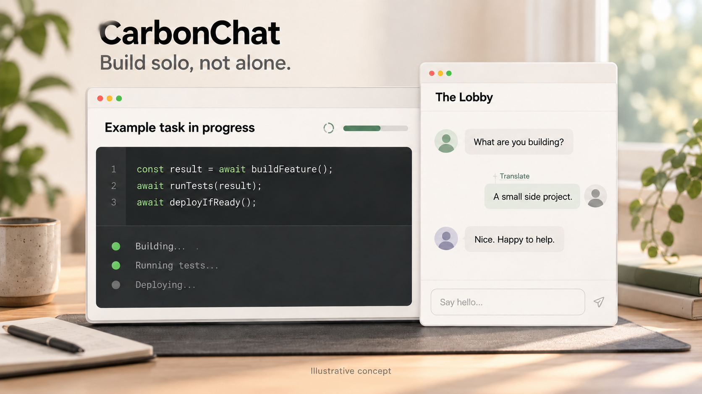

[English](README.md) | [简体中文](README.zh-CN.md)

# CarbonChat



*概念示意图，并非实际界面或真实用户。*

**Codex 用户的真人聊天室**

CarbonChat 为你的 Codex 工作区带来一间共享聊天室：**The Lobby（大厅）**。任务运行时，打个招呼、问个问题、聊聊正在做的东西，或者只看不说，都欢迎。普通聊天不调用你的 Agent。

## 进来坐坐

把这句话复制给 Codex，代码块右上角可以一键复制：

```text
请从 https://github.com/JetXu-LLM/carbonchat-plugin 安装 CarbonChat，带我完成登录并打开大厅。
```

收到提示后批准安装，使用 GitHub 登录，再亲自审阅访问请求、《[参与条款](https://carbonchat.codexforwork.com/terms)》《[隐私说明](https://carbonchat.codexforwork.com/privacy)》《[社区规则](https://carbonchat.codexforwork.com/rules)》及 **18 岁以上**确认。目前仅支持 GitHub 登录，不请求私有仓库权限；进入大厅还需通过服务当前的准入检查。

如果设置提示你开启新对话，在那里继续一次即可，不必重新安装。[设置帮助](INSTALLER.md)

**已经装好了？** 对 Codex 说：**Launch CarbonChat Lobby.** 如果侧栏中已有 CarbonChat，也可以直接点击。入口是否可用取决于你的 Codex 宿主环境。

## 随意聊，也可以安静看

- **聊天、回复、表情回应。** 同一间房，按对话顺序展开。
- **只看不说。** 阅读不需要自我介绍或设置资料。想发言时，再选择昵称和预设头像。
- **看看精选。** 最多五条精选消息，点击即可回到原消息。入选不代表背书，也不会延长保留期。
- **跨语言交流。** 选择一条消息，让你的 Agent 翻译，在自己的大厅视图里阅读译文。

## Agent 随你选择

翻译只在你主动请求时进行。所选消息会发给与你关联的当前 Agent，在该私人对话中新增一条可见请求，并使用其额度。译文仅显示在你自己的应用视图中。切换原文和已有译文不会再次请求 Agent。译文在请求创建 10 分钟后过期；若原消息或你的访问权限不可用，则会更早失效。

你也可以主动选中消息，加入私人 Agent 对话。Agent 帮忙写的帖子会先保留为私人草稿，待你核对最终文字并确认后才发布。

打开大厅或使用可选的 Agent 帮助时，建议选择 **GPT Luna · Light**（如果提供）。CarbonChat 无法选择或验证模型，也无法保证使用单独的 Agent 对话。

## 共享的房间，清楚的边界

大厅对获准成员可见，**不保密，也不是端到端加密**。成员可以复制或截图，请勿发布密钥或机密工作内容。CarbonChat 不会自动分享你的项目；房间里显示的是你选择的昵称和预设头像。

运营者的 OpenAI 助手 dot 可能阅读此前 24 小时内必要的大厅新消息，用于社区安全和挑选最多五条精选。举报证据仅用于安全审核。这些审核独立于可选的 Agent 功能。详情见《[隐私说明](https://carbonchat.codexforwork.com/privacy)》。

## 把想法告诉我们

[反馈问题](https://github.com/JetXu-LLM/carbonchat-plugin/issues/new?template=1-bug-report.yml) · [提出建议](https://github.com/JetXu-LLM/carbonchat-plugin/issues/new?template=2-feature-idea.yml) · [已有议题](https://github.com/JetXu-LLM/carbonchat-plugin/issues)

中英文都欢迎。议题是公开的，请移除个人资料、私人聊天、密码、令牌及登录或回调链接，截图中也一样。安全问题或不便公开的问题，请发邮件至 [support@carbonchat.codexforwork.com](mailto:support@carbonchat.codexforwork.com)，请勿发送密码或令牌。

CarbonChat 由 Jet Xu 运营。本仓库是自行维护的插件来源，并非官方目录收录。
